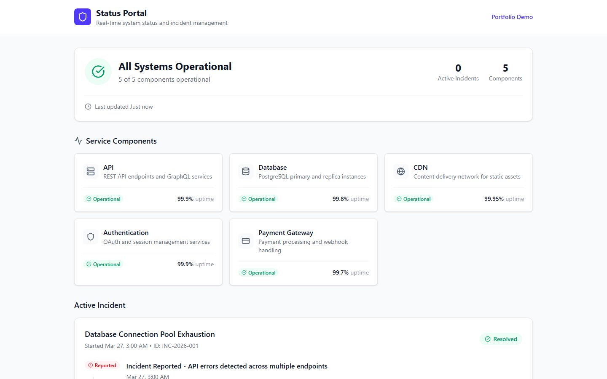
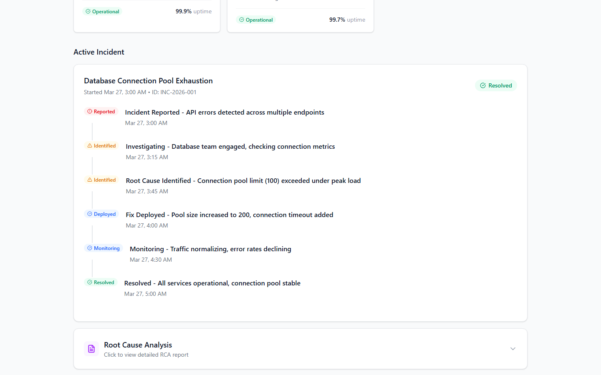
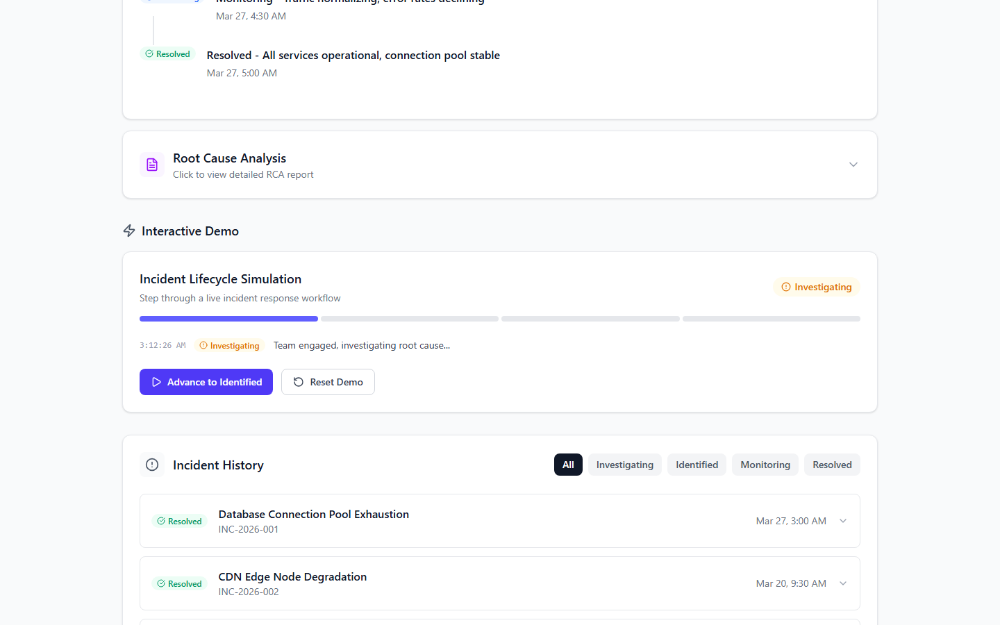

# Incident Status & RCA Portal

A professional status page and incident management portal demonstrating system health communication and root cause analysis documentation. Built as a portfolio project to showcase Application Support and QA Automation skills.


## Screenshots

These image slots are intentionally kept in the README as proof placeholders for the status page UI.

| Status Overview | Incident Timeline | RCA Panel |
|----------------|-------------------|-----------|
|  |  |  |

> Replace the placeholder image files in `docs/screenshots/` with current captures from the remade UI.

## Source inspiration disclosure

This portfolio rebuild is visually and structurally inspired by open-source status page platforms:

- **[Cachet](https://github.com/cachethq/Cachet)** — status page communication patterns, component health visualization, incident timeline structure

This is an original React implementation for portfolio use. The goal is to study real support product patterns and recreate the feel of that workflow in a smaller standalone app. No source code was copied from those projects.

## Support relevance

This repo is meant to show work that maps directly to application support and production triage responsibilities.

| Support workflow | Relevance |
|------------------|-----------|
| Status communication | Transparent service health visibility for stakeholders |
| Incident timeline | Chronological event tracking during outages |
| RCA documentation | Structured post-incident analysis and prevention planning |
| Component monitoring | Track uptime and health of dependent services |
| Stakeholder updates | Clear communication during incident lifecycle |

## Overview

This portal simulates a real-world status page used by organizations to communicate system health to stakeholders and document incident post-mortems. It demonstrates key concepts in:

- **Status Communication** - Transparent service health visibility
- **Incident Timeline** - Chronological event tracking
- **Root Cause Analysis** - Structured post-incident documentation
- **Stakeholder Updates** - Clear, timely communication during incidents

## Features

### Status Overview
- **System Health Indicator** - Overall status at a glance
- **Component Grid** - 5 service components with individual status
- **Uptime Metrics** - Mock uptime percentages for each service
- **Last Updated** - Timestamp for transparency

### Component Status
**5 Monitored Services:**
- API (99.9% uptime)
- Database (99.8% uptime)
- CDN (99.95% uptime)
- Authentication (99.9% uptime)
- Payment Gateway (99.7% uptime)

**Status States:**
- 🟢 Operational
- 🟡 Degraded Performance
- 🟠 Partial Outage
- 🔴 Major Outage

### Incident Timeline
- **Vertical Timeline** - Chronological event visualization
- **Status Badges** - Investigating, Identified, Monitoring, Resolved
- **Event Types** - Reported, Root Cause Identified, Fix Deployed, etc.
- **Relative Timestamps** - Time since incident start

### RCA Panel
- **Expandable Panel** - Structured RCA display
- **Key Fields:**
  - Summary
  - Root Cause
  - Impact Assessment
  - Resolution Steps
  - Prevention Measures
  - Duration
  - Detection Method

### Incident History
- **Filterable List** - By status (All, Investigating, Identified, Monitoring, Resolved)
- **Quick Overview** - Title, status, affected components
- **Detailed View** - Full incident with timeline and RCA

## Demo Scenario

**Incident: Database Connection Pool Exhaustion**

A complete incident scenario demonstrating the full lifecycle:

1. **T+0** - Incident Reported (API errors detected)
2. **T+15min** - Investigating (Database team engaged)
3. **T+45min** - Root Cause Identified (Connection pool exhausted)
4. **T+1hr** - Fix Deployed (Pool size increased)
5. **T+1.5hr** - Monitoring (Traffic normalizing)
6. **T+2hr** - Resolved (All services operational)

**RCA Summary:**
- **Root Cause:** Connection pool limit (100) exceeded under peak load
- **Impact:** 15% of users experienced errors for 2 hours
- **Resolution:** Increased pool size to 200, added connection timeout
- **Prevention:** Implement connection pooling metrics, add autoscaling

## Tech stack

| Layer | Technology |
|-------|-----------|
| Framework | React 19 |
| Language | TypeScript 5.9 |
| Build | Vite 8 |
| Styling | Tailwind CSS 4 |
| Testing | Vitest + React Testing Library |
| Icons | Lucide React |

## Installation

```bash
# Clone the repository
git clone <your-repo-url>
cd incident-status-rca-portal

# Install dependencies
npm install

# Start development server
npm run dev
```

## Run commands

```bash
npm install
npm run dev
npm test
npm run build
npm run preview
```

## Project Structure

```
src/
├── components/
│   ├── StatusOverview.tsx     # System health dashboard
│   ├── ComponentGrid.tsx      # Service component cards
│   ├── ComponentCard.tsx      # Individual component
│   ├── IncidentTimeline.tsx   # Timeline visualization
│   ├── TimelineEvent.tsx      # Individual timeline events
│   ├── RCAPanel.tsx           # Root cause analysis panel
│   ├── StatusBadge.tsx        # Status indicators
│   └── IncidentHistory.tsx    # Past incidents list
├── data/
│   ├── components.ts          # Service definitions
│   └── incidents.ts           # Incident scenarios
├── types/
│   └── incident.ts            # TypeScript interfaces
├── utils/
│   └── date.ts                # Date formatting
└── App.tsx                    # Main portal layout
```

## Key Concepts Demonstrated

### Incident Communication
- Transparent status page communication
- Timeline-based stakeholder updates
- Clear severity classification
- Post-incident documentation standards

### Frontend Engineering
- Component-based architecture
- Type-safe data modeling
- Responsive grid layouts
- State management for filtering

### Support Engineering
- Understanding of incident lifecycle
- RCA documentation best practices
- Service dependency awareness
- Communication during outages

## Postmortem: Database Connection Pool Exhaustion

### Incident Summary
- **Duration:** 2 hours
- **Impact:** 15% of users experienced API errors
- **Severity:** Major Outage

### Root Cause
Connection pool limit (100) was exceeded under peak load. The application did not implement connection timeout or retry logic.

### Timeline
| Time | Event |
|------|-------|
| T+0 | API 502 errors detected by monitoring |
| T+15min | Database team engaged |
| T+45min | Root cause identified |
| T+1hr | Fix deployed - pool size increased to 200 |
| T+1.5hr | Monitoring - traffic normalizing |
| T+2hr | Resolved - all services operational |

### Action Items
1. Implement connection pooling metrics
2. Add autoscaling for database connections
3. Create runbook for connection pool issues

## Testing

```bash
# Run tests
npm test

# Run tests once (CI)
npx vitest run
```

Tests cover:
- **StatusBadge** - renders correct labels and colors for each status type
- **ComponentCard** - displays component name, description, uptime, and status badge
- **IncidentTimeline** - renders incident title, ID, and all timeline events in order

## What This Demonstrates for Application Support + QA Automation

This project demonstrates key competencies for support engineering roles:

### Operational Awareness
- Understanding of status page communication and transparency
- Incident timeline tracking and stakeholder updates
- Service dependency awareness and health monitoring
- Post-incident documentation and RCA standards

### Technical Skills
- React + TypeScript frontend development
- Component-based architecture with proper typing
- Test-driven development (Vitest + React Testing Library)
- CI/CD awareness (GitHub Actions)

### Support Engineering Mindset
- Clear incident communication during outages
- Root cause analysis (RCA) methodology
- Postmortem documentation and action items
- Prevention planning and process improvement

### Portfolio Value
This is an original inspired rebuild, not a direct clone. It demonstrates understanding of incident management without requiring production infrastructure.

## Inspiration

This project was inspired by [Cachet](https://github.com/cachethq/Cachet), an open-source status page platform. It is an original rebuild for portfolio demonstration purposes, not a direct clone.

## License

MIT

---

**Built for Portfolio** | React + TypeScript + Vite + Tailwind CSS
